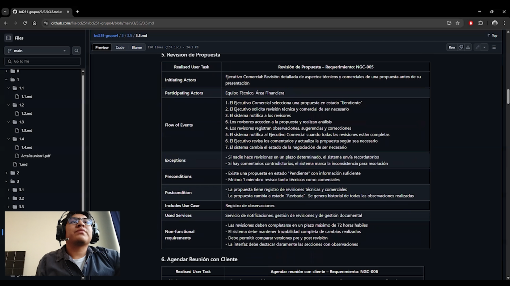
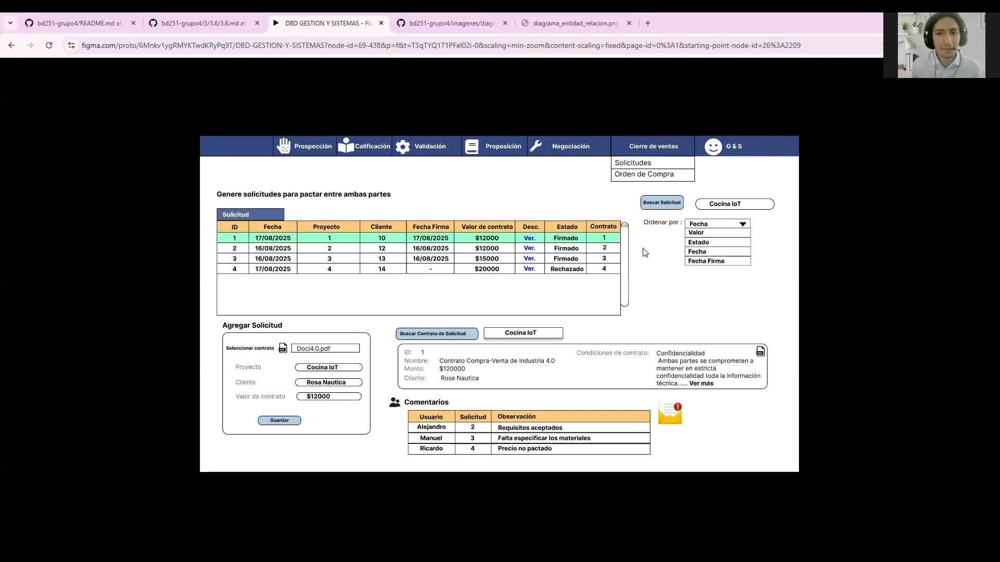

# 0.7. Presentaciones Individuales (Videos) por cada PC

### PC 1: Presentaciones Individuales

### Integrante 1 - Rojas Candela, Gonzalo Jesus

---
### Integrante 2 - Venegas Zambrano, Jose Alexander

### Integrante 3 - Salazar Aguilar, Jeanpier Jose

---
### Integrante 4 - Huamán Salinas, Ailton Mario

---
### Integrante 5 - Landeo Ramon, Diego Franco

---
### Integrante 6 - Canales Cuéllar, José Luis Santiago

---
