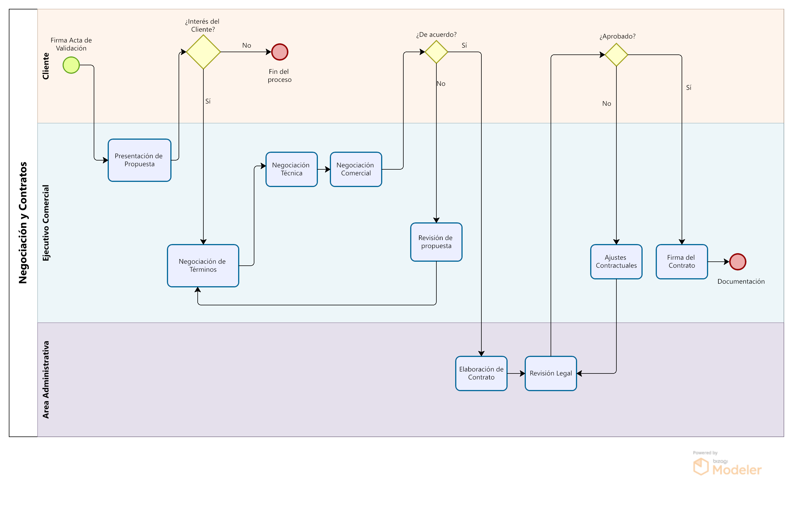
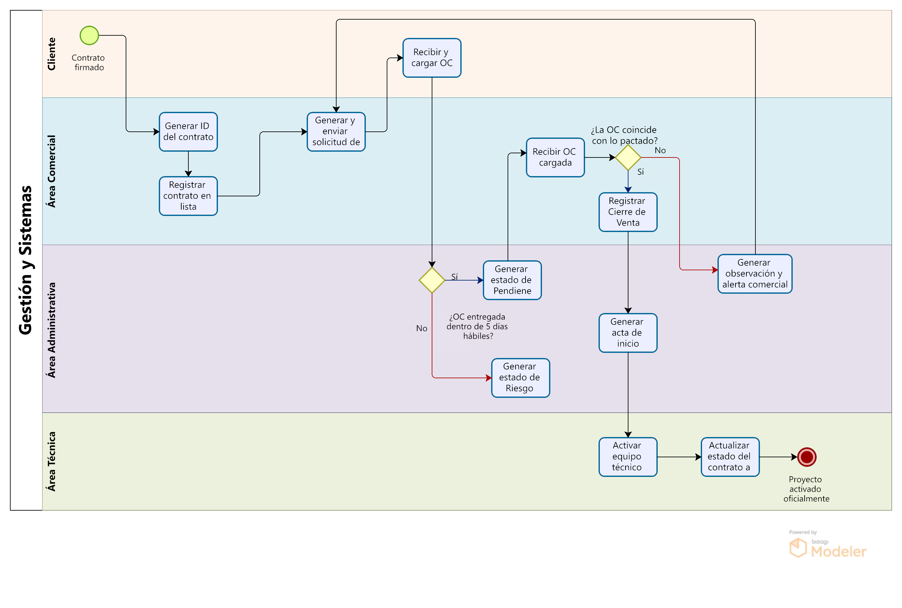

# 1.3. Procesos de Negocio identificados

# Módulos
Los módulos que se abordarán en el trabajo son los siguientes:

1. Gestión de Prospectos  
2. Calificación de Oportunidades  
3. Validación de Requisitos  
4. Generación de Propuestas  
5. Negociación y Contratos  
6. Cierre de Ventas

# Detalle de los módulos

## *1. Gestión de Prospectos*

| Nro | Actividad                                          | Descripción                                                                                                                                         | Responsable                   |
|-----|----------------------------------------------------|-----------------------------------------------------------------------------------------------------------------------------------------------------|-------------------------------|
| 1   | Analizar mercado                                   | Evaluar el estado actual del mercado para identificar posibles oportunidades de negocio.                                                            | Área Estratégica Comercial    |
| 2   | Seleccionar sector                                 | Determinar el sector específico en el que se enfocará la prospección, basado en proyectos anteriores realizados.                                       | Área Estratégica Comercial    |
| 3   | Buscar en el portafolio proyectos relacionados     | Revisar el portafolio de proyectos anteriores para identificar aquellos que sean relevantes para el sector seleccionado.                             | Área Estratégica Comercial    |
| 4   | Listar proyectos                                   | Generar una lista de los proyectos pasados que pueden ser utilizados como referencia para designarla a un ejecutivo estratégico                                            | Área Estratégica Comercial    |
| 5   | Verificar si hay solicitudes relacionadas          | Comprobar si existen solicitudes que coincidan con el sector o proyectos a prospectar.                                                       | Área Estratégica Comercial    |
| 6   | Buscar Leads                                       | Buscar prospectos a través de diversas fuentes de datos como base de datos, redes de contactos o clientes actuales.                                                     | Ejecutivo Comercial           |
| 7   | Buscar en BD top 10k                               | Consultar la base de datos del top 10k empresas a nivel nacional.                                                     | Ejecutivo Comercial           |
| 8   | Consultar en red de contactos                      | Revisar las redes de contacto existentes, por ejemplo socios o colegas, para obtener leads de empresas o personas relevantes.                                                      | Ejecutivo Comercial           |
| 9   | Buscar cliente actual                              | Analizar a los clientes actuales con el interés de realizar un up-selling o un cross-selling                                         | Ejecutivo Comercial           |
| 10  | Consolidar lista de leads                          | Reunir toda la información obtenida de las diversas fuentes de leads y organizarla para su evaluación posterior.                                     | Ejecutivo Comercial           |
| 11  | Seleccionar lead                                   | Seleccionar el prospecto potencial más adecuado basado en la lista consolidada.                                                                                | Ejecutivo Comercial           |
| 12  | Enviar presentación corporativa y experiencia      | Enviar una presentación sobre la empresa y experiencia en el sector a través de la lista de proyectos escogidos en el portafolio                                                  | Ejecutivo Comercial           |
| 13  | Solicitar visita                                   | Pedir una reunión o visita a la empresa prospectada para analizar la empresa.                                                      | Ejecutivo Comercial           |
| 14  | Agendar reunión                                    | Establecer la fecha, hora y modalidad de la reunión (presencial o virtual).                                                                         | Ejecutivo Comercial           |
| 15  | Esperar encuentro                                  | Esperar el momento de la reunión con el prospecto.                                                                                                 | Ejecutivo Comercial           |
| 16  | Visitar a la empresa                               | Realizar la visita a la empresa prospectada para presentar experiencia en su sector y escuchar sus necesidades.                                                   | Ejecutivo Comercial           |
| 17  | Escuchar al prospecto                              | Durante la visita, escuchar las necesidades y problemáticas del prospecto para comprender sus requerimientos.                                         | Ejecutivo Comercial           |
| 18  | Registrar dolencias                                | Documentar las necesidades o problemas identificados durante la visita.                                                                             | Ejecutivo Comercial           |
| 19  | Registrar si coincide o no con proyectos pasados   | Verificar si las necesidades del prospecto coinciden con proyectos anteriores y registrar esa información.                                           | Ejecutivo Comercial           |
| 20  | Registrar solicitud                                | Registrar formalmente la solicitud de empresa que ha enviado correo solicitando información.                                                                   | Ejecutivo Comercial           |
| 21  | Anunciar dolencias                                 | Comunicar las dolencias identificadas.                                                                          | Ejecutivo Comercial           |
| 22  | Pasar al proceso de calificación                   | Transferir los prospectos al modulo de Calificación                    | Ejecutivo Comercial           |
| 23  | Solicitar información por correo                   | La empresa a traves de la página web de la empresa solicita información                                               | Ejecutivo Comercial           |
| 24  | Responder solicitud                                | El cliente responde a la solicitud realizada, confirmando o no el interés.                                                                         | Cliente                       |
| 25  | Confirmar solicitud                                | Verificar si el prospecto confirma o no su solicitud para avanzar en la prospección.                                                               | Cliente                       |
| 26  | Termina Prospección                                | Finalizar el proceso si la solicitud no es confirmada por el prospecto.                                                                              | Cliente                       |

---

## *2. Calificación de Oportunidades*

| **Nro** | **Actividad**                            | **Descripción**                                                                                                     | **Responsable**         |
|--------|-----------------------------------------------------|---------------------------------------------------------------------------------------------------------------------|--------------------------|
| 1      | Registro de necesidad o dolor                       | Se registra que un cliente ha manifestado una necesidad o un “dolor” operativo o estratégico.                      | Ejecutivo Comercial      |
| 2      | Identificar stakeholder presente                    | Se identifica si el interlocutor es un stakeholder clave.                                                           | Ejecutivo Comercial      |
| 3      | ¿Es decisor con poder de compra?                    | Se evalúa si el stakeholder tiene poder de decisión o se requiere escalar.                                         | Ejecutivo Comercial      |
| 4      | Solicitar acceso a la autoridad                     | Si no es el decisor, se gestiona acceso a quien sí tiene autoridad para decidir.                                   | Ejecutivo Comercial      |
| 5      | Solicitar análisis técnico preliminar               | Si se avanza, se solicita un análisis técnico preliminar de viabilidad (alto nivel).                               | Ejecutivo Comercial      |
| 6      | Validar tipo de convocatoria                        | Se analiza si la oportunidad es parte de una convocatoria formal y abierta.                                        | Gerente Comercial        |
| 7      | ¿Convocatoria formal y abierta?                     | Se determina si la convocatoria permite una competencia real o es cerrada/disfrazada.                              | Gerente Comercial        |
| 8      | Registrar sobre falta de transparencia              | En caso negativo, se documenta la falta de transparencia del proceso.                                              | Gerente Comercial        |
| 9      | ¿Experiencia en esta solución?                      | Se verifica si la empresa ya ha trabajado con tecnologías similares o en proyectos equivalentes.                   | Equipo Técnico           |
| 10     | Verificar la posibilidad de un partner              | Si no hay experiencia, se considera la posibilidad de asociarse con un socio estratégico.                          | Equipo Técnico           |
| 11     | ¿Es necesario un partner?                           | Se determina si, para cumplir con los requisitos, se requiere un socio adicional.                                  | Equipo Técnico           |
| 12     | ¿Es viable técnicamente?                            | Se evalúa la viabilidad técnica del proyecto (alto nivel).                                                         | Equipo Técnico           |
| 13     | Aliarse con un partner                              | Se establece la alianza con otro proveedor o consultora para cubrir las brechas técnicas.                          | Equipo Técnico           |
| 14     | Registrar oportunidad inviable técnicamente         | Si no es viable, se documenta que no se puede atender la oportunidad desde lo técnico.                             | Equipo Técnico           |
| 15     | Aprobación o descarte de la oportunidad             | Con base en el análisis, se decide si se continúa con la oportunidad o se descarta.                                | Gerente Comercial        |
| 16     | Emitir resumen del proceso                          | Se genera un documento resumen de la calificación de la oportunidad con todos los hallazgos y decisiones.          | Ejecutivo Comercial      |

---

## 3. Validación de Requisitos

| Nro | Actividad | Descripción | Responsable |
|-----|-----------|-------------|-------------|
| 1 | **Cliente envía requisitos** | Envío inicial de necesidades (sin formato estándar). | Cliente |
| 2 | **Recepción de requisitos** | Registro en sistema de gestión. Análisis preliminar por Gerente de Proyecto (no equipo genérico). | Gerente de Proyecto |
| 3 | **Valida claridad** | Verificar que los requisitos sean específicos y medibles (evitar términos vagos). | Gerente de Proyecto |
| 4 | **Solicitar aclaración** | Comunicación estructurada con cliente (no llamadas informales). | Gerente de Proyecto |
| 5 | **Designa 1 analista + 1 técnico** | Asignación de recursos temporales (máximo 2 personas). Priorizar roles según complejidad. | Gerente de Línea |
| 6 | **Análisis de viabilidad técnica** | Validar: 1) Cumplimiento normativo, 2) Dependencias externas, 3) Volumen de datos. Durante el análisis. | Área Técnica |
| 7 | **Propone alternativas** | Opciones realistas: Prueba de concepto (POC), ajuste de alcance o tecnologías alternativas. | Área Técnica  |
| 8 | **Evalúa costos** | Comparar costo real (según tarifas base) vs. presupuesto cliente. No reducir tarifas, solo descuentos. | Gerente de Línea |
| 9 | **Opciones comerciales** | - Descuento puntual - Fasear proyecto - Reducir alcance  | Gerente de Línea |
| 10 | **Negociar hitos de pago** | Acordar porcentajes de pago vinculados a entregables. | Gerente de Línea |
| 11 | **Fasear proyectos** | Dividir el proyecto en etapas si el presupuesto es insuficiente (ej: Fase 1: Core, Fase 2: Mejoras). | Gerente de Línea |
| 12 | **Reducir alcance** | Eliminar funcionalidades no críticas para ajustarse al presupuesto. | Gerente de Línea |
| 13 | **Prepara documentación** | PDF con: 1) Requisitos aprobados, 2) Alcance excluido destacado, 3) Hitos de facturación. | Área Técnica |
| 14 | **Validación formal con cliente** | Reunión final para confirmar requisitos y alcance con los decisores clave. | Cliente |
| 15 | **Firmar acta de validación** | Firma digital obligatoria: Cliente + Gerente de Proyecto. Registro de IP y timestamp. | Cliente + GP |
| 16 | **Actualización de repositorio** | Subir documentos finales (PDF, actas, grabaciones) a SharePoint/Git con control de versiones. | Área Técnica |

---

## *4. Generación de Propuestas*

| Nro | Actividad                                               | Descripción                                                                                                                                                                                                                                | Responsable                                      |
|-----|---------------------------------------------------------|--------------------------------------------------------------------------------------------------------------------------------------------------------------------------------------------------------------------------------------------|--------------------------------------------------|
| 1   | Elaborar Prepropuesta Técnica                           | Redactar un borrador inicial que detalle la solución técnica, integrando los requerimientos y el alcance definidos.                                                                                                                        | Área Técnica                                     |
| 2   | Revisión Interna y Ajustes Iterativos                   | Revisar por pares la prepropuesta y realizar los ajustes necesarios. Si se identifican observaciones, se itera el proceso hasta alcanzar los estándares internos.                                                                      | Área Técnica                                     |
| 3   | Reunión de Integración Técnica y Administrativa         | Coordinar una sesión conjunta para validar de manera integral los aspectos técnicos y financieros del borrador, unificando criterios entre las áreas involucradas.                                                                      | Área Técnica y Área Administrativa               |
| 4   | Realizar Ajustes Posteriores a la Integración           | Incorporar las observaciones surgidas de la reunión de integración, afinando la propuesta con las correcciones pertinentes.                                                                                                                 | Área Técnica                                     |
| 5   | Calcular y Presentar ROI                                | Determinar el Retorno sobre la Inversión (ROI) utilizando tarifas y datos predefinidos, documentando los resultados que respalden la propuesta.                                                                                             | Área Administrativa                              |
| 6   | Elaborar Presupuesto Detallado                          | Desglosar los costos del proyecto considerando tarifas, recursos y tiempos estimados, generando un presupuesto integral y ajustado a la solución propuesta.                                                                               | Área Administrativa                              |
| 7   | Aprobación Interna del Presupuesto y Ajustes            | Someter el presupuesto a revisión interna. Si se requieren modificaciones, realizarlas y volver a presentar hasta obtener la aprobación.                                                                                                   | Área Administrativa                              |
| 8  | Preparar Material de Presentación                       | Consolidar la propuesta final en un formato de presentación (documento, diapositivas, etc.), destacando de forma clara la solución, el ROI y el presupuesto.                                                                              | Área Comercial                                   |
| 9  | Coordinar Reunión con el Cliente                        | Organizar y agendar la reunión para la presentación de la propuesta, definiendo la agenda y la logística del encuentro.                                                                                                                     | Área Comercial                                   |
| 10  | Presentar Propuesta al Cliente                          | Exponer la solución, el ROI y el presupuesto detallado, recopilando la retroalimentación inicial del cliente durante la reunión.                                                                                                             | Área Comercial                                   |
| 11  | Abordar Objeciones y Aclarar Dudas                        | Gestionar y resolver las objeciones o dudas planteadas por el cliente. En esta etapa, el Área Técnica interviene para ajustar aspectos técnicos, mientras que el Área Comercial coordina la respuesta.                               | Área Comercial y Área Técnica                    | Registrar de manera formal las respuestas, acuerdos, cambios o compromisos asumidos con el cliente, consolidando esta información en el CRM u otros repositorios documentales corporativos. | Área Comercial                                   |
| 13  | Evaluar Respuesta del cliente | Según la respuesta del cliente:  - Si existe interés positivo, iniciar la negociación para formalizar el acuerdo.  - Si no hay interés, documentar la respuesta en el CRM y cerrar el proceso.                           | Área Comercial |

---

## *5. Negociación y Contratos*

 
 | Nro | Actividad | Descripción | Responsable |
  ---|-----------|-------------|------------------|
 | 1 | **Presentación de Propuesta** | Exposición detallada de la solución técnica, beneficios y condiciones generales al cliente | Ejecutivo Comercial|
 | 2 | **Negociación de Términos** | Discusión sobre alcance, plazos, entregables y adaptaciones de la propuesta inicial | Ejecutivo Comercial |
 | 3 | **Negociación Técnica** | Definición detallada de especificaciones técnicas, arquitectura, integraciones y requisitos de implementación | Ejecutivo Comercial |
 | 4 | **Negociación Comercial** | Acuerdos sobre precios, modelos de facturación, términos de pago y condiciones comerciales | Ejecutivo Comercial |
 | 5 | **Revisión de Propuesta** | Ajustes a la propuesta original basados en feedback del cliente y resultado de las negociaciones | Ejecutivo Comercial |
 | 6 | **Elaboración de Contrato** | Redacción del documento legal que formaliza los acuerdos alcanzados | Personal Administrativo |
 | 7 | **Revisión Legal** | Análisis de implicaciones legales, validación de cláusulas y términos contractuales | Personal Administrativo |
 | 8 | **Ajustes Contractuales** | Modificaciones al contrato basadas en observaciones del departamento legal o negociaciones finales | Ejecutivo Comercial |
 | 9 | **Firma de Contrato** | Formalización del acuerdo mediante la firma de todas las partes involucradas | Ejecutivo Comercial |
 | 10 | **Documentación** | Remisión de la parte contractual con todas las aclaraciones establecidas | Personal Administrativo |

---

## *6. Cierre de Ventas*

| Nro | Actividad                              | Descripción                                                                                     | Responsable         |
|----|----------------------------------------|-------------------------------------------------------------------------------------------------|---------------------|
| 1  | Contrato firmado                       | Inicio del proceso. Ambas partes firman el contrato.                                            | Cliente             |
| 2  | Generar ID del contrato                | Se crea un identificador único del contrato firmado.                                            | Ejecutivo Comercial |
| 3  | Registrar contrato en lista            | El contrato se almacena en el sistema con estado “Pendiente”.                                  | Ejecutivo Comercial |
| 4  | Generar y enviar solicitud de OC       | Se genera la solicitud formal de orden de compra y se envía al cliente.                        | Ejecutivo Comercial |
| 5  | Recibir y cargar OC                    | El cliente carga la OC en la plataforma.                                                       | Cliente             |
| 6  | ¿OC entregada dentro de 5 días?        | Se evalúa si la OC fue recibida en el tiempo acordado.                                         | Gerente Comercial   |
| 7  | Generar estado de Pendiente            | Se registra el estado de OC como pendiente dentro del plazo.                                   | Gerente Comercial   |
| 8  | Generar estado de Riesgo Activo        | Si no llega la OC, se marca como “Firmado sin OC – Riesgo Activo”.                             | Gerente Comercial   |
| 9  | Recibir OC cargada                     | Verifica la carga correcta del documento de OC.                                                | Ejecutivo Comercial |
| 10 | ¿OC coincide con lo pactado?           | Se valida si los términos de la OC son iguales a los del contrato.                             | Ejecutivo Comercial |
| 11 | Generar observación y alerta comercial | Si hay diferencias, se informa y se solicita corrección.                                       | Ejecutivo Comercial |
| 12 | Registrar cierre de venta              | Confirmación de OC válida, se cierra comercialmente.                                           | Ejecutivo Comercial |
| 13 | Generar acta de inicio                 | Documento de inicio del proyecto.                                                              | Gerente Comercial   |
| 14 | Activar equipo técnico asignado        | El equipo técnico es notificado y activado para ejecución.                                     | Área Técnica        |
| 15 | Actualizar estado del contrato         | El contrato pasa de “Pendiente” a “En curso”.                                                  | Área Técnica        |
| 16 | Proyecto activado oficialmente         | El proyecto inicia formalmente.                                                                | Área Técnica        |

---
