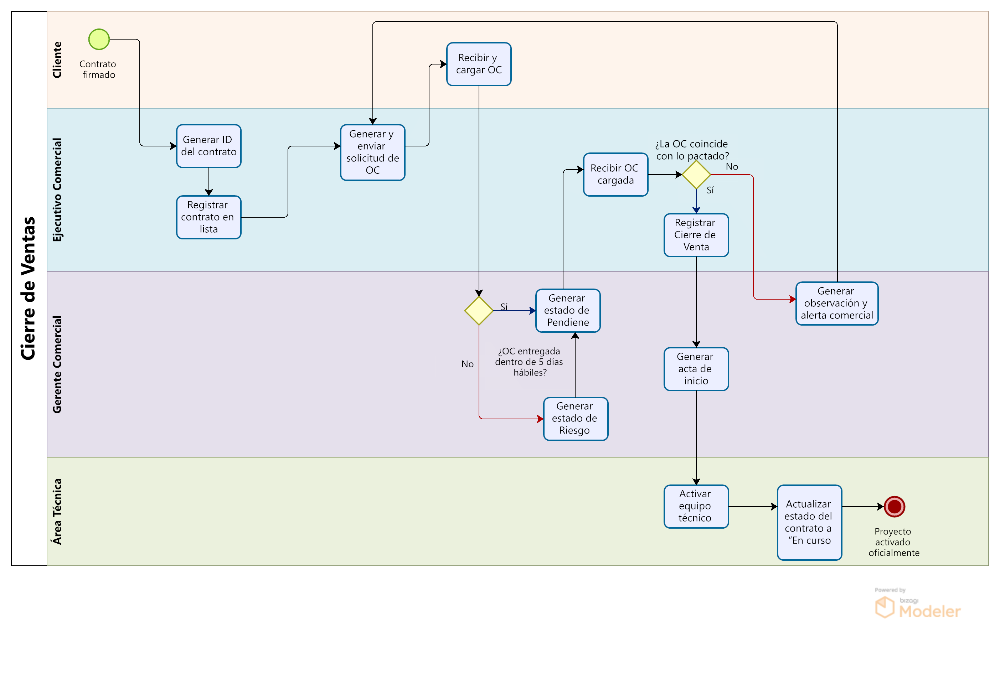

# 1.3. Procesos de Negocio identificados

## Entrevista

## Módulos
Los módulos que se abordarán en el trabajo son los siguientes:

1. Gestión de Prospectos  
2. Calificación de Oportunidades  
3. Validación de Requisitos  
4. Generación de Propuestas  
5. Negociación y Contratos  
6. Cierre de Ventas  

# Detalle de los módulos

## Gestión de Prospectos

Descripción

### Interacción con otros módulos

### Responsabilidades
-  
-  
-  

---

## Calificación de Oportunidades 

Descripción

### Interacción con otros módulos

### Responsabilidades
-  
-  
-  

---

## Validación de Requisitos

Descripción

### Interacción con otros módulos

### Responsabilidades
-  
-  
-  

---

## Generación de Propuestas

Descripción

### Interacción con otros módulos

### Responsabilidades
-  
-  
-  

---

## Negociación y Contratos

Descripción

### Interacción con otros módulos

### Responsabilidades
-  
-  
-  

---

## Cierre de Ventas

El módulo de **Cierre de Ventas** se activa una vez que el contrato ha sido firmado por ambas partes. Desde ese punto, se formaliza el proceso mediante la generación de la Orden de Compra (OC), su validación, y la activación del proyecto técnico correspondiente.

Incluye automatización del flujo de solicitud de OC, validación comercial y administrativa, y asignación del equipo técnico.

### Interacción con otros módulos

- Requiere datos de **Negociación y Contratos** (contrato firmado)
- Notifica a **Validación Técnica** para activar el equipo asignado
- Comunica estado a **Seguimiento Postventa**

### Responsabilidades
- Registrar el contrato y generar solicitud de OC  
- Verificar que la OC sea recibida a tiempo y coincida con el contrato  
- Emitir alerta si no se recibe o hay discrepancia  
- Confirmar el cierre como “ganado”  
- Activar equipo técnico y generar acta de inicio  
- Cambiar el estado del proyecto a “En curso”

### Diagrama del Proceso

### Actividades del Proceso

| Actividad                           | Descripción                                                                 | Responsable             |
|------------------------------------|------------------------------------------------------------------------------|--------------------------|
| Contrato firmado                   | Inicio del proceso. Ambas partes firman el contrato.                        | Cliente y Área Comercial |
| Generar ID del contrato            | Se crea un identificador único del contrato firmado.                        | Área Comercial           |
| Registrar contrato en lista        | El contrato se almacena en el sistema con estado “Pendiente”.              | Área Comercial           |
| Generar y enviar solicitud de OC   | Se genera la solicitud formal de orden de compra y se envía al cliente.     | Área Comercial           |
| Recibir y cargar OC                | El cliente carga la OC en la plataforma.                                    | Cliente                  |
| ¿OC entregada dentro de 5 días?    | Se evalúa si la OC fue recibida en el tiempo acordado.                      | Área Administrativa      |
| Generar estado de Pendiente        | Se registra el estado de OC como pendiente dentro del plazo.                | Área Administrativa      |
| Generar estado de Riesgo Activo    | Si no llega la OC, se marca como “Firmado sin OC – Riesgo Activo”.          | Área Administrativa      |
| Recibir OC cargada                 | Verifica la carga correcta del documento de OC.                             | Área Comercial           |
| ¿OC coincide con lo pactado?       | Se valida si los términos de la OC son iguales a los del contrato.          | Área Comercial           |
| Generar observación y alerta comercial | Si hay diferencias, se informa y se solicita corrección.                | Área Comercial           |
| Registrar cierre de venta          | Confirmación de OC válida, se cierra comercialmente.                         | Área Comercial           |
| Generar acta de inicio             | Documento de inicio del proyecto.                                            | Área Administrativa      |
| Activar equipo técnico asignado    | El equipo técnico es notificado y activado para ejecución.                  | Área Técnica             |
| Actualizar estado del contrato     | El contrato pasa de “Pendiente” a “En curso”.                                | Área Técnica             |
| Proyecto activado oficialmente     | El proyecto inicia formalmente.                                              | Área Técnica             |

---
