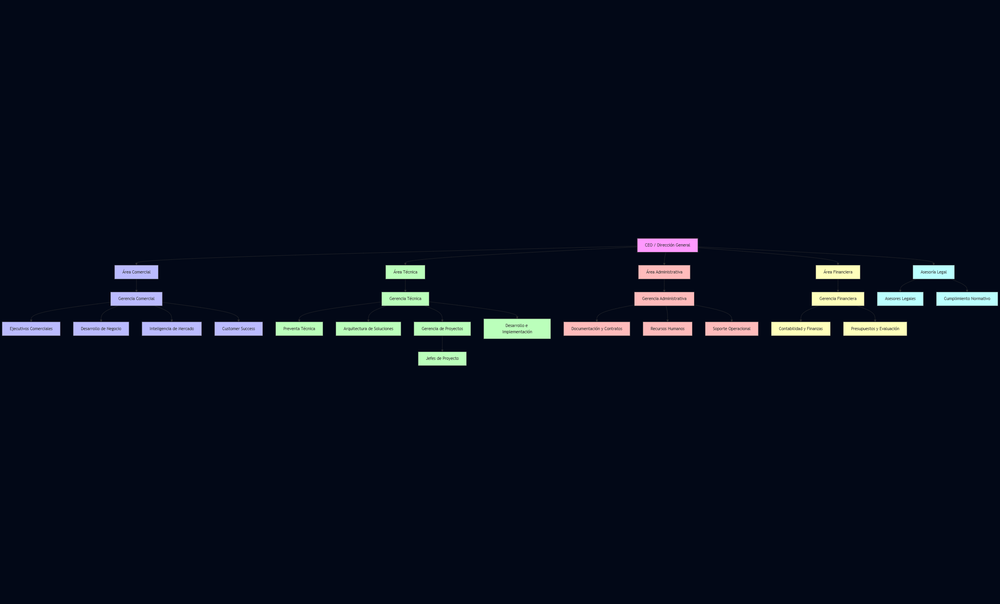

# 1. Descripción de la Empresa Elegida

## Descripción general
Empresa peruana líder en el desarrollo e implementación de soluciones tecnológicas y de transformación digital, enfocada
en ayudar a las organizaciones a optimizar sus procesos, mejorar la eficiencia y potenciar su crecimiento mediante la
implementación de tecnologías innovadoras.

## Misión
Potenciar la transformación digital de pequeñas, medianas y grandes empresas implementando soluciones de TI y enfoque
en proyectos de innovación. 

## Visión
Ser reconocidos como líderes en la transformación digital, brindando soluciones integrales que potencien tu negocio en la
era digital.

## Servicios y productos

### Cuadro Rseumen de Servicios de Gestion y Sistemas

| **CATEGORÍA**                                | **SERVICIO**                                            | **DESCRIPCIÓN**                                                                                                                                                         |
|---------------------------------------------|---------------------------------------------------------|-------------------------------------------------------------------------------------------------------------------------------------------------------------------------|
| **1. DATA ANALYTICS & AI**                   | Evaluaciones y migración de Data Warehouse              | Optimización, migración y evaluación de plataformas de datos, incluyendo modernización hacia la nube y creación de hojas de ruta estratégicas.                          |
|                                             | Elaboración de modelos de IA/ML                         | Desarrollo de modelos predictivos, asistentes virtuales, automatización con IA, soluciones con GPT y gestión del ciclo de vida con MLOps.                              |
|                                             | Soluciones de Inteligencia de Negocios                  | Implementación de Power BI, arquitecturas de BI personalizadas, integración de datos, definición de KPIs y visualización avanzada.                                     |
|                                             | Implementación de Plataformas Analíticas                | Diseño de arquitecturas escalables (Data Lake, Big Data, Data Warehouse moderno), DataOps, procesamiento en tiempo real y seguridad de datos.                          |
| **2. INDUSTRIA 4.0**                                            | Video Analítica                                         | Software para análisis autónomo de video en tiempo real, generación de metadatos y monitoreo automatizado.                                                             |
|                          | IoT Industrial                                          | LoRaWAN: Tecnología de bajo consumo para redes IoT escalables en entornos industriales alineada con la Industria 4.0.                                                                                                                                                                 |
|                                             | Digital Twins                                           | Representación virtual de activos físicos con datos en tiempo real para optimización y análisis predictivo.                                                             |
|                                             | Plataforma Industria 4.0                                | Centralización de datos de sensores y video analítica, integrada con IA para toma de decisiones industriales.                                                           |
| **3. INFRAESTRUCTURA Y CLOUD**              | Asignación de Consultores                               | Soporte personalizado con gestores dedicados para operación y administración en Azure.                                                                                  |
|                                             | Proyectos en Nube                                       | Migración a Azure, aprovisionamiento de recursos, seguridad avanzada, entornos SAP y contingencia en la nube.                                                           |
|                                             | Cloud Hosting + Cloud Services Management               | Entornos Azure bajo modelo CSP, facturación basada en consumo, dashboards en Power BI y soporte continuo.                                                              |
|                                             | Consultoría en Gobierno Cloud                          | Alineación al Cloud Adoption Framework (CAF) e integración de ISO 20000-1 con conceptos ITIL.                                                                           |
|                                             | Soporte de Infra & Cloud (Bolsa de Horas)               | Respuesta ágil ante incidentes con expertos certificados y acceso directo a soporte de Microsoft.                                                                      |
|                                             | Assessment de Seguridad                                 | Evaluación de vulnerabilidades, protección de datos y cumplimiento normativo.                                                                                           |
|                                             | Despliegue de Infraestructura como Código               | Automatización de infraestructura mediante scripts, eliminando procesos manuales.                                                                                       |
| **4. MODERN WORKPLACE Y BUSINESS SOLUTIONS**| Implementación de Microsoft 365                         | Migración a Exchange Online, integración con Active Directory, seguridad básica (MFA, filtrado de amenazas).                                                            |
|                                             | Servicios de Consultoría y Soporte en M365              | Estrategias personalizadas para maximizar productividad y seguridad con Microsoft 365.                                                                                 |
|                                             | Migración e Implementación de SharePoint                | Migración de SharePoint On-Premise a Online, mejora de colaboración y gestión documental.                                                                               |
|                                             | Automatización con Power Platform                       | Desarrollo de aplicaciones (Power Apps), automatización de procesos (Power Automate), análisis de datos (Power BI) y chatbots (Virtual Agents).                        |
|                                             | Migración + Implementación de CRM/ERP                   | Migración e implementación de Dynamics CRM (gestión de clientes) y ERP (finanzas, inventario, RRHH).                                                                   |
| **5. DESARROLLO DE SOFTWARE Y MESAS ÁGILES** | Desarrollo de Software a Medida                         | Creación de aplicaciones móviles, web y soluciones de automatización integradas.                                                                                        |
|                                             | Arquitectura y Consultoría                              | Diseño de arquitecturas escalables (microservicios, Kubernetes, seguridad, DevOps/DevSecOps) y mejores prácticas.                                                       |
|                                             | Modernización de Aplicaciones                           | Diagnóstico, planificación, migración y optimización y actualización de aplicaciones legacy.                                                                            |
|                                             | Mesas Ágiles y Outsourcing                              | Equipos de alto rendimiento con perfiles técnicos especializados (desarrolladores, arquitectos, QA, etc.) para proyectos flexibles y escalables.                        |

## Información adicional
[Sitio web de Gestion y Sistemas](https://gestionysistemas.com)

## Organigrama

## Contacto

- Nombre: Rubén Parodi
- Cargo: Socio y Gerente de Operaciones y Recursos Humanos
- Correo: ruben.parodi@gestionysistemas.com
- LinkedIn: https://www.linkedin.com/in/rubenparodiguerrero/

--- 

2. Información para el trabajo

- [Datos de la empresa](1.1/1.1.md)
- [Modelo de negocio](1.1/1.1.md)
- [Procesos de negocio identificados](1.1/1.1.md)

**[Regresar al README](../README.md)**
