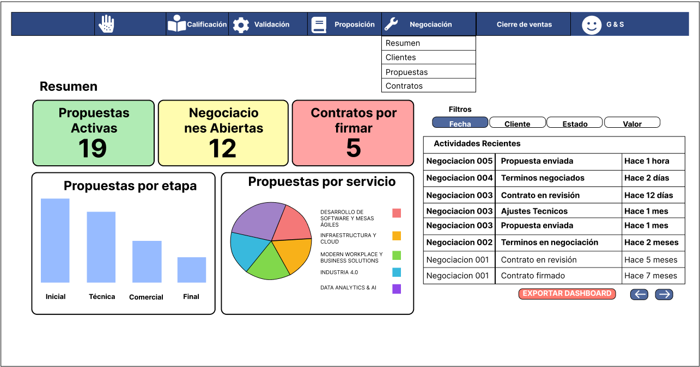
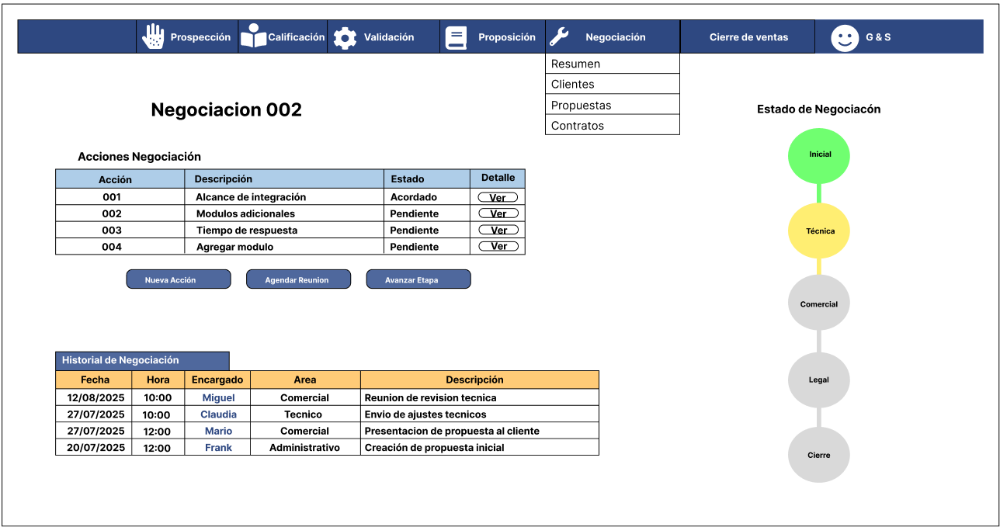
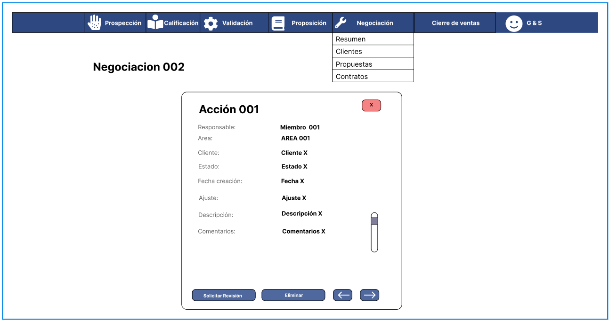
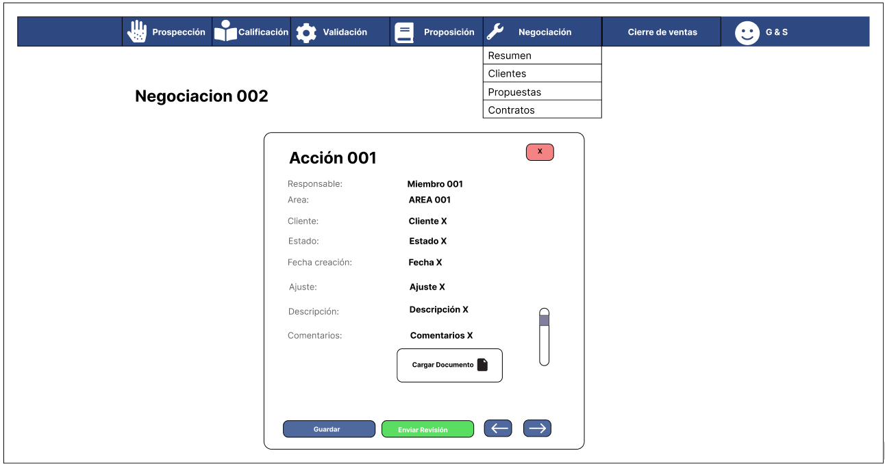
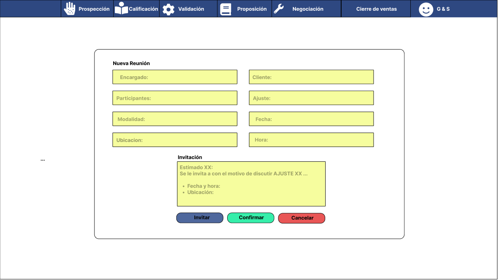
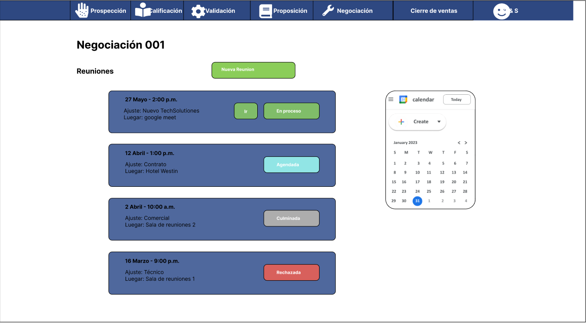
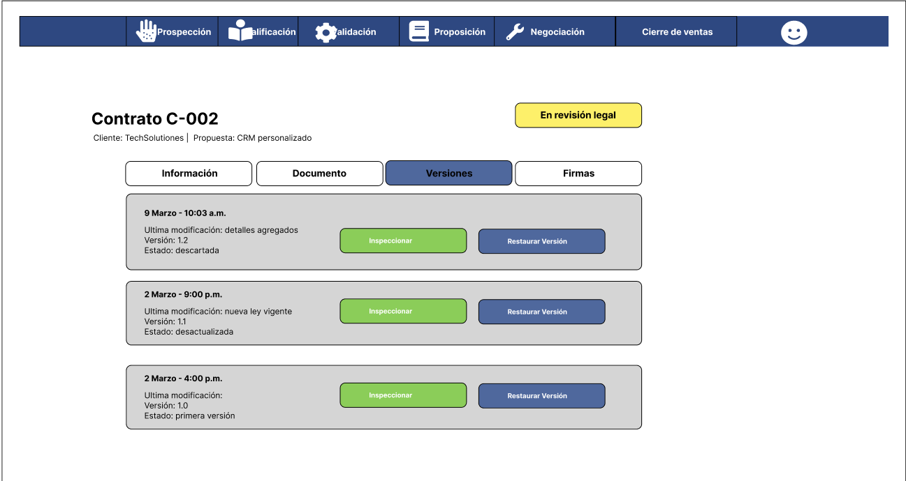
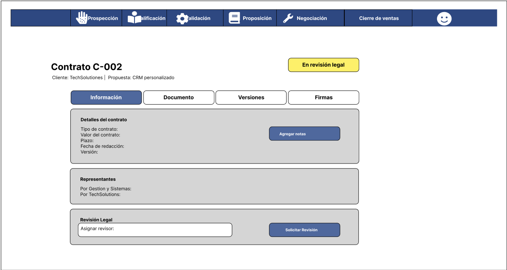
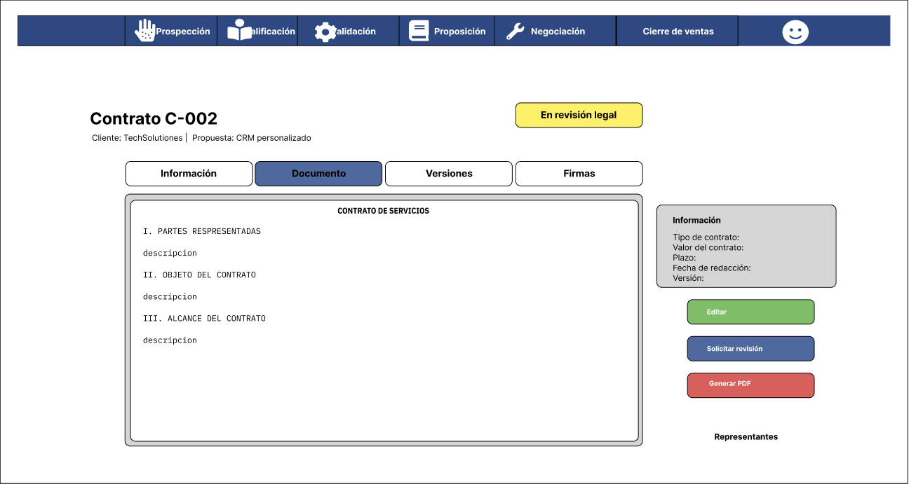
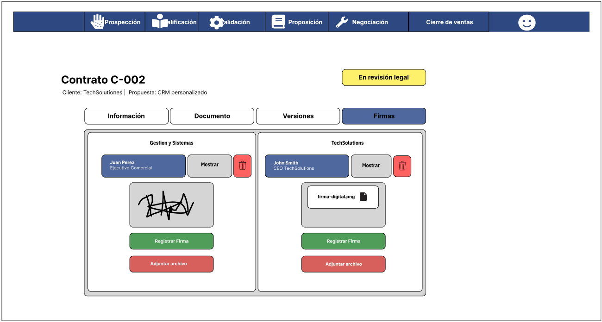

# 3.5. Módulo 5

## Casos de uso:

### 1. Visualización de Negociaciones

| **Realised User Task**                     | **Visualización de Negociaciones – Requerimiento: NGC-001**                                                                                                         |
|-------------------------------|---------------------------------------------------------------------------------------------------------------------|
| **Initiating Actors**          | Ejecutivo Comercial: Visualizar y gestionar todas las propuestas, negociaciones abiertas y contratos desde un panel centralizado |
| **Participating Actors**       | - CEO (opcional) |
| **Flow of Events**             | 1. El Ejecutivo Comercial accede a la opción "Dashboard de Propuestas" en el menú principal 2. El sistema carga y muestra el panel con todas las propuestas y negociaciones activas 3. El sistema muestra listado de propuestas organizadas por etapa (propuestas presentadas, negociaciones activas, contrato por firmar) 4. El Ejecutivo puede filtrar por cliente, estado, rango de fechas o valor 5. El Ejecutivo selecciona una propuesta específica para ver detalles 6. El sistema entra para obtener detalles 7. El sistema permite exportar reportes del dashboard en diferentes formatos |
| **Exceptions**                 | - Si hay demasiadas propuestas activas, el sistema pagina los resultados - Si hay problemas de conexión, muestra versión limitada con datos en caché - Si hay propuestas con alertas (próximas a vencer, estancadas), se destacan visualmente |
| **Preconditions**              | El Ejecutivo Comercial está autenticado en el sistema |
| **Postcondition**              | - Se registra la actividad de visualización en logs - Las propuestas con alertas de seguimiento se marcan como revisadas si se accede a ellas |
| **Includes Use Case**          | - Filtrado de propuestas - Generación de reportes - Visualización de timeline |
| **Used Services**              | - Servicio de dashboard analítico - Servicio de búsqueda y filtrado - Servicio de reportes - Servicio de visualización de timeline |
| **Non-functional requirements**| - El dashboard debe cargar en el menor tiempo posible - Los filtros deben aplicarse instantánea y simultaneamente sin recargar la página - Las métricas críticas deben actualizarse automáticamente -Deben verse graficos y cuadros de buena calidad para una correcta visaulización |

### 2. Negociación de Términos

| **Realised User Task**                     | **Negociación de Términos – Requerimiento: NGC-002**                                                                                                         |
|-------------------------------|---------------------------------------------------------------------------------------------------------------------|
| **Initiating Actors**          | Ejecutivo Comercial: Gestiona los avances en la negociación de términos con el cliente|
| **Participating Actors**       | - CEO (de ser necesario) - Cliente |
| **Flow of Events**             | 1. El Ejecutivo selecciona una propuesta en estado "Pendiente", "En revisión" o "Acordado" 2. El Ejecutivo selecciona "Nueva Acción" 3. El sistema muestra formulario con los términos actuales 4. El Ejecutivo registra cambios en términos (alcance, plazos, entregables) 5. El Ejecutivo documenta acuerdos alcanzados y puntos pendientes 6. Si hay aspectos técnicos complejos, marca la opción "Solicitar revisión" 7. El sistema guarda los cambios y actualiza el estado de la negociación 8. Si se solicitó revisión técnica, el sistema notifica al equipo técnico o comercial |
| **Exceptions**                 |  - Si hay términos contradictorios, el sistema advierte al usuario - Si faltan detalles obligatorios, solicita completar |
| **Preconditions**              | - Existe como minimo una propuesta creada - El Ejecutivo tiene permisos sobre la negociación |
| **Postcondition**              | - Registro actualizado del proceso de negociación - Se actualizan los términos de la negociación - Se registra la actividad en el historial - Se notifica a involucrados relevantes |
| **Includes Use Case**          | - Solicitud de revisión técnica y/o comercial (opcional)|
| **Used Services**              | - Servicio de gestión de negociaciones - Servicio de notificaciones - Servicio de comparación de versiones |
| **Non-functional requirements**| - Debe notificar lo mas pronto posible a los involucrados |

### 3. Negociación Técnica

| **Realised User Task**                     | **Negociación Técnica – Requerimiento: NGC-003**                                                                                                         |
|-------------------------------|---------------------------------------------------------------------------------------------------------------------|
| **Initiating Actors**          | Ejecutivo Comercial: realiza acciones de ajuste y las gestiona con el cliente |
| **Participating Actors**       | Equipo Técnico (opcional) |
| **Flow of Events**             | 1. Visualiza acciones pendientes 2. Selecciona una acción 3. Revisa requerimientos del cliente 4. Completa formulario de especificaciones técnicas 5. Adjunta diagramas o documentación técnica 6. Envía respuesta al Ejecutivo Comercial |
| **Exceptions**                 | - Si faltan datos obligatorios o no se emite mensajes como sustento, el sistema muestra un mensaje de error - Solicitud de información adicional si es necesario - Propuesta de alternativas técnicas |
| **Preconditions**              | Contar con la propuesta tecnica definida enviada por Ejecutivo Comercial - Permisos de revisión del equipo técnico  - El responsable debe estar correctamente identificado con su rol|
| **Postcondition**              | Especificaciones técnicas registradas en el sistema - Notificar al cliente |
| **Includes Use Case**          | Solicitud de revisión técnica (opcional), Carga de documentos |
| **Used Services**              | Solicitud de ajustes en términos técnicos, Escalamiento a niveles superiores para casos especiales |
| **Non-functional requirements**| Solicitud de revisión técnica y Carga de documentos|

### 4. Negociación Comercial

| **Realised User Task**                     | **Negociación Comercial – Requerimiento: NGC-004**                                                                                                         |
|-------------------------------|---------------------------------------------------------------------------------------------------------------------|
| **Initiating Actors**          | Ejecutivo Comercial: Crear y/o modifica una accion comercial a un cliente |
| **Participating Actors**       | Área Financiera (opcional)|
| **Flow of Events**             | 1. El ejecutivo comercial selecciona "Nueva Accion" en la seccion de ajustes 2. El sistema muestra el formulario de creación de ajuste 3. El ejecutivo completa los datos básicos (cliente, descripción, alcance) 4. El ejecutivo solicita colaboración del equipo financiero si es necesario para especificaciones 5. El área financiera revisa y completa la sección de precios 6. El ejecutivo envía la accion de ajuste al cliente a través del sistema |
| **Exceptions**                 | - Si faltan datos obligatorios, el sistema muestra un mensaje de error - Si hay inconsistencias en precios, se notifica al área financiera |
| **Preconditions**              | Contar con la propuesta tecnica definida enviada por Ejecutivo Comercial - Permisos de revisión del equipo financiero  - El responsable debe estar correctamente identificado con su rol  |
| **Postcondition**              | - Acción registradas en el sistema |
| **Includes Use Case**          | Consulta de Clientes, Gestión de Presupuesto, Solicitud de revisión técnica (opcional) |
| **Used Services**              | Solicitud de ajustes en términos financieros, Escalamiento a niveles superiores para casos especiales|
| **Non-functional requirements**| - El sistema debe permitir trabajar con el tipo de cambio y mostrarlo |

### 5. Revisión de Propuesta

| **Realised User Task**                     | **Revisión de Propuesta – Requerimiento: NGC-005**                                                                                                         |
|-------------------------------|---------------------------------------------------------------------------------------------------------------------|
| **Initiating Actors**          | Ejecutivo Comercial: Revisión detallada de aspectos técnicos y comerciales de una propuesta antes de su presentación |
| **Participating Actors**       | Equipo Técnico, Área Financiera |
| **Flow of Events**             | 1. El Ejecutivo Comercial selecciona una propuesta en estado "Pendiente" 2. El Ejecutivo solicita revisión técnica y comercial de ser necesario 3. El sistema notifica a los revisores 6. Los revisores acceden a la propuesta y realizan análisis 4. Los revisores registran observaciones, sugerencias y correcciones 5. El sistema notifica al Ejecutivo Comercial cuando todas las revisiones están completas 6. El Ejecutivo revisa los comentarios y actualiza la propuesta según sea necesario  7. El sistema cambia el estado de la negociación de ser necesario|
| **Exceptions**                 | - Si nadie hace revisiones en un plazo determinado, el sistema envía recordatorios - Si hay comentarios contradictorios, el sistema marca la inconsistencia para resolución |
| **Preconditions**              | - Existe una propuesta en estado "Pendiente" con información suficiente - Mnimo 1 miembro revisor tanto técnicos como comerciales |
| **Postcondition**              | - La propuesta tiene registro de revisiones técnicas y comerciales - La propuesta cambia a estado "Revisada"- Se genera historial de todas las observaciones realizadas |
| **Includes Use Case**          | Registro de observaciones |
| **Used Services**              | Servicio de notificaciones, gestión de revisiones y de gestión documental |
| **Non-functional requirements**| - Las revisiones deben completarse en un plazo máximo de 72 horas habiles - El sistema debe mantener trazabilidad completa de cambios realizados - Debe permitir comparar versiones pre y post revisión - La interfaz debe destacar claramente las secciones con observaciones |

### 6. Agendar Reunión con Cliente

| **Realised User Task**                     | **Agendar reunión con cliente – Requerimiento: NGC-006**                                                                                                         |
|-------------------------------|---------------------------------------------------------------------------------------------------------------------|
| **Initiating Actors**          | Ejecutivo Comercial: Programar y gestionar reuniones con clientes para presentar y discutir propuestas |
| **Participating Actors**       | Cliente |
| **Flow of Events**             | 1. El Ejecutivo Comercial selecciona una propuesta en estado "Revisada" para presentación 2. El Ejecutivo elige "Agendar reunión" 3. El sistema muestra calendario con disponibilidad del Ejecutivo 4. El Ejecutivo selecciona fecha, hora propuestas, y modalidad (presencial/virtual) 5. El Ejecutivo añade detalles como ubicación/enlace y agenda 6. El Ejecutivo selecciona participantes internos adicionales (opcional) 7. El sistema genera invitación formal para el cliente 8. El Ejecutivo personaliza mensaje de invitación y confirma envío 9. El sistema envía invitación al cliente  10. Al recibir respuesta del cliente, el sistema actualiza el estado de la reunión 11. El sistema envía recordatorios automáticos 24 horas y 1 hora antes 12. Tras la reunión, el sistema solicita al Ejecutivo registrar resultados |
| **Exceptions**                 | - Si el cliente rechaza o solicita reprogramación, el sistema facilita proceso de nueva agenda - Si hay conflictos de calendario, el sistema advierte y sugiere horarios alternativos |
| **Preconditions**              | - Existe una propuesta en estado adecuado para presentación - Se cuenta con información de contacto actualizada del cliente |
| **Postcondition**              | - Se crea evento en calendario con todos los detalles - Se envían invitaciones a todos los participantes - Se asocia la reunión al historial de la propuesta y cliente - Se activan recordatorios automáticos |
| **Includes Use Case**          | - Envío de invitaciones - Programación de recordatorios |
| **Used Services**              | - Servicio de gestión de calendario - Servicio de correo electrónico - Servicio de notificaciones  |
| **Non-functional requirements**| - Debe sincronizarse con calendarios externos (Outlook, Google Calendar) - Las invitaciones deben incluir adjuntos relevantes de la propuesta - Debe funcionar en dispositivos móviles para confirmaciones en movimiento - Debe incluir opciones de accesibilidad para reuniones virtuales - El sistema debe enviar recordatorios incluso si el usuario no está conectado |

### 7. Solicitar Elaboración de Contrato

| **Realised User Task**                     | **Solicitar Elaboración de Contrato – Requerimiento: NGC-007**                                                                                                         |
|-------------------------------|---------------------------------------------------------------------------------------------------------------------|
| **Initiating Actors**          | Ejecutivo Comercial: Solicita la elaboración formal del contrato tras acuerdo en términos |
| **Participating Actors**       | Personal Administrativo |
| **Flow of Events**             | 1. El sistema genera, según un formate preestablecido, el contrato donde se establecen los terminos acrodados 2. El sistema muestra el resumen en la seccion de "información" 3. El Ejecutivo verifica la información y añade notas específicas si es necesario 4. El Ejecutivo confirma la solicitud 5. El sistema registra y notifica al Personal Administrativo sobre la nueva solicitud 6. El sistema genera un borrador preliminar basado en la plantilla y términos |
| **Exceptions**                 | - Si faltan términos obligatorios, el sistema impide continuar - Si hay inconsistencias en los términos, muestra advertencias |
| **Preconditions**              | - La negociación tiene todos los términos principales acordados - El Ejecutivo tiene autorización para solicitar contratos |
| **Postcondition**              | - Se crea una solicitud de contrato en el sistema - La negociación cambia a estado "Legal" - Se notifica al Personal Administrativo |
| **Includes Use Case**          | - Generación automática de borrador de contrato |
| **Used Services**              |  - Servicio de gestión documental - Servicio de notificaciones - Servicio de generación de documentos |
| **Non-functional requirements**| - El borrador preliminar debe generarse inmediatamente - Debe guardar historial de todas las versiones del contrato |

### 8. Elaboracion del Contrato

| **Realised User Task**                     | **Elaboración del Contrato – Requerimiento: NGC-008**                                                                                                         |
|-------------------------------|---------------------------------------------------------------------------------------------------------------------|
| **Initiating Actors**          | Personal Administrativo: registra el documento contractual formal basado en los términos acordados |
| **Participating Actors**       | Asesor Legal |
| **Flow of Events**             | 1. El Personal Administrativo selecciona una solicitud de contrato pendiente 2. El sistema muestra el borrador preliminar y los términos acordados 3. El Personal Administrativo edita el contrato según sea necesario 4. El Personal Administrativo completa cláusulas específicas y anexos 5. El Personal Administrativo marca si requiere revisión legal 6. Si requiere revisión legal, asigna al Asesor Legal correspondiente 7. El Personal Administrativo finaliza el borrador de contrato |
| **Exceptions**                 | - Si faltan datos obligatorios, el sistema marca los campos incompletos - Si hay inconsistencias legales detectadas, muestra advertencias |
| **Preconditions**              | - Existe una solicitud de contrato aprobada - El Personal Administrativo tiene acceso a las plantillas necesarias |
| **Postcondition**              | - Se crea el borrador de contrato en el sistema - Se notifica a los involucrados sobre el cambio de estado |
| **Includes Use Case**          | - Asignación de revisión legal (opcional) |
| **Used Services**              | - Servicio de gestión documental - Servicio de generación de documentos - Servicio de notificaciones |
| **Non-functional requirements**| - El editor de texto debe permitir formato legal específico - Debe mantener consistencia de estilos con la imagen corporativa |

### 9. Revisión Legal

| **Realised User Task**                     | **Revisión Legal – Requerimiento: NGC-009**                                                                                                         |
|-------------------------------|---------------------------------------------------------------------------------------------------------------------|
| **Initiating Actors**          | Personal Administrativo: Revisar los aspectos legales del contrato y emitir observaciones |
| **Participating Actors**       | Asesor Legal |
| **Flow of Events**             | 1. El Asesor Legal recibe notificación de contrato por revisar 2. El Asesor Legal accede al borrador del contrato 3. El sistema muestra el contrato y herramientas de revisión 4. El Asesor Legal revisa el contrato y añade comentarios/sugerencias 5. El Asesor Legal marca secciones que requieren modificación 6. El Asesor Legal completa la revisión y cambia el estado 7. El sistema notifica al Personal Administrativo y Ejecutivo Comercial |
| **Exceptions**                 | - Si el documento está siendo editado por otro usuario, notifica y bloquea edición |
| **Preconditions**              | - El Asesor Legal tiene los permisos necesarios |
| **Postcondition**              | - Se registran las observaciones legales - Se notifica a involucrados sobre la finalización de la revisión |
| **Includes Use Case**          | -- |
| **Used Services**              | - Servicio de gestión documental - Servicio de control de versiones - Servicio de notificaciones |
| **Non-functional requirements**| - Debe permitir trabajar en modo offline con sincronización posterior - Debe mantener historial de cambios con identificación de autor|

### 10. Ajustes Contractuales

| **Realised User Task**                     | **Ajustes Contractuales – Requerimiento: NGC-010**                                                                                                         |
|-------------------------------|---------------------------------------------------------------------------------------------------------------------|
| **Initiating Actors**          | Ejecutivo Comercial: Modificar el contrato según observaciones legales o del cliente |
| **Participating Actors**       | Personal Administrativo |
| **Flow of Events**             | 1. El Ejecutivo Comercial selecciona un contrato con observaciones 2. El sistema muestra el contrato y las observaciones registradas 3. El Ejecutivo revisa las observaciones y determina ajustes necesarios 4. El Ejecutivo registra instrucciones para los ajustes 5. El Ejecutivo solicita al Personal Administrativo realizar los cambios 6. El Personal Administrativo actualiza el contrato según indicaciones 7. El sistema actualiza la versión del contrato 8. El Ejecutivo Comercial valida los cambios realizados |
| **Exceptions**                 | - Si los ajustes contradicen términos críticos, muestra advertencia - Si requiere nueva aprobación del cliente, cambia el flujo |
| **Preconditions**              | - Existe un contrato con revisión legal completada - El Ejecutivo tiene permisos sobre el contrato |
| **Postcondition**              | - Se crea una nueva versión del contrato - Se registra el historial de cambios |
| **Includes Use Case** | -- |        
| **Used Services** | - Servicio de gestión documental - Servicio de control de versiones - Servicio de notificaciones |
| **Non-functional requirements**| - Debe permitir comparación visual entre versiones - Debe registrar qué observaciones fueron atendidas |

### 11. Firma de Contrato

| **Realised User Task**                     | **Firma de Contrato – Requerimiento: NGC-0011**                                                                                                         |
|-------------------------------|---------------------------------------------------------------------------------------------------------------------|
| **Initiating Actors**          | Ejecutivo Comercial: Coordinar y registrar la firma del contrato por las partes involucradas |
| **Participating Actors**       | CEO, Cliente (indirecto) |
| **Flow of Events**             | 1. El Ejecutivo Comercial selecciona un contrato en "Firmas" 2. El sistema muestra opciones de firmar 3. El Ejecutivo digita su firma o sube un archivo valido que la represente  4. Tras la firma, el Ejecutivo registra la conclusión del proceso 5. El sistema actualiza el estado a "Contrato firmado" 6. El sistema notifica a todas las áreas involucradas |
| **Exceptions**                 | - Si se postpone la firma, permite reprogramar - Si hay cambios de último momento, permite registrarlos |
| **Preconditions**              | - El contrato está finalizado y aprobado - Todas las partes están de acuerdo con los términos |
| **Postcondition**              | - El contrato cambia a estado "Firmado" - Se registra la fecha oficial de firma - Se inicia el proceso de documentación |
| **Includes Use Case**          | - Carga de documentos firmados |
| **Used Services**              | - Servicio de gestión de citas - Servicio de firma digital (opcional) - Servicio de notificaciones |
| **Non-functional requirements**| - Debe permitir firma electrónica segura - Debe generar recordatorios automáticos |

### 12. Documentación

| **Realised User Task**                     | **Documentación – Requerimiento: NGC-012**                                                                                                         |
|-------------------------------|---------------------------------------------------------------------------------------------------------------------|
| **Initiating Actors**          | Personal Administrativo: Crea y archiva la documentación contractual completa |
| **Participating Actors**       | -- |
| **Flow of Events**             | 1. El Ejecutivo Comercial selecciona un contrato 2. Tras la firma, el Ejecutivo registra la conclusión del proceso 3. El Ejecutivo sube el contrato firmado o confirma firma digital 4. El sistema actualiza el estado a "Contrato firmado" 5. El sistema notifica a todas las áreas involucradas |
| **Exceptions**                 | - Si hay cambios de último momento, permite registrarlos |
| **Preconditions**              | - El contrato está finalizado y aprobado - Todas las partes están de acuerdo con los términos |
| **Postcondition**              | - El contrato cambia a estado "Firmado" - Se registra la fecha oficial de firma - Se inicia el proceso de documentación |
| **Includes Use Case**          | - Carga de documentos firmados |
| **Used Services**              | - Servicio de gestión de citas - Servicio de firma digital (opcional) - Servicio de notificaciones |
| **Non-functional requirements**| - Debe permitir firma electrónica segura - Debe generar recordatorios automáticos |

## PROTOTIPO

