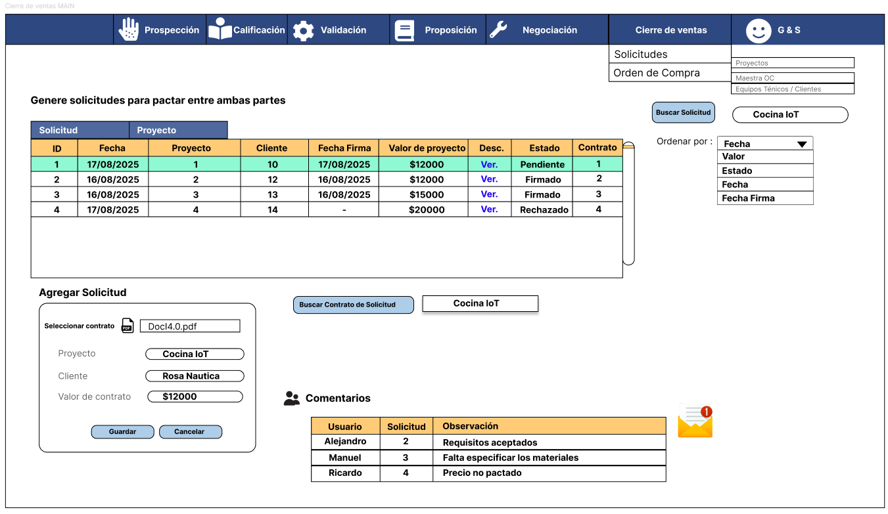
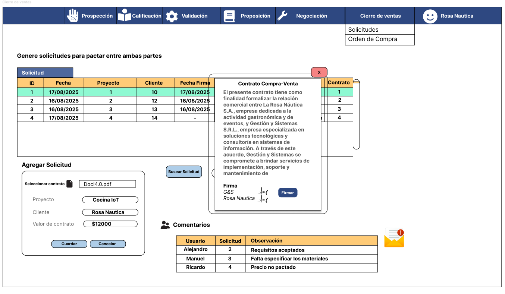
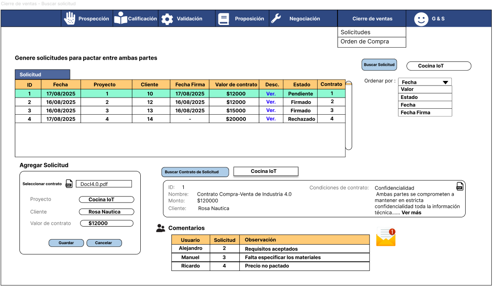
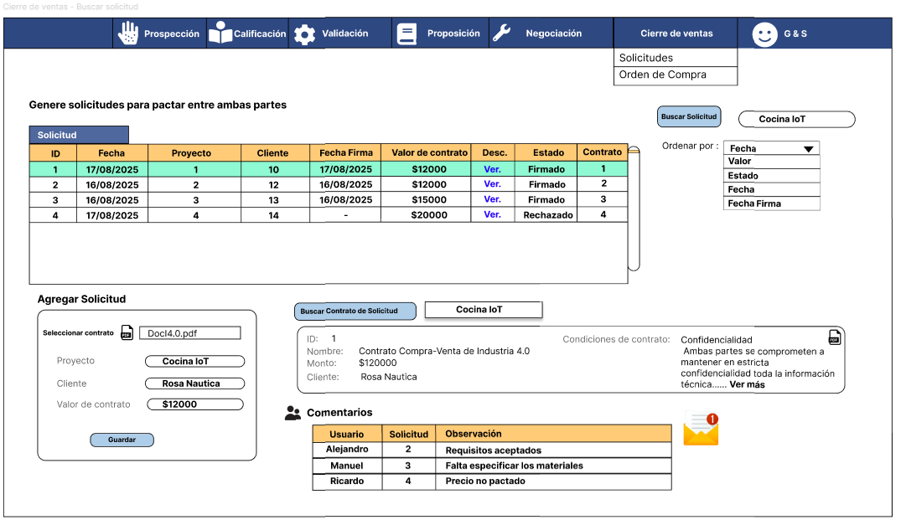
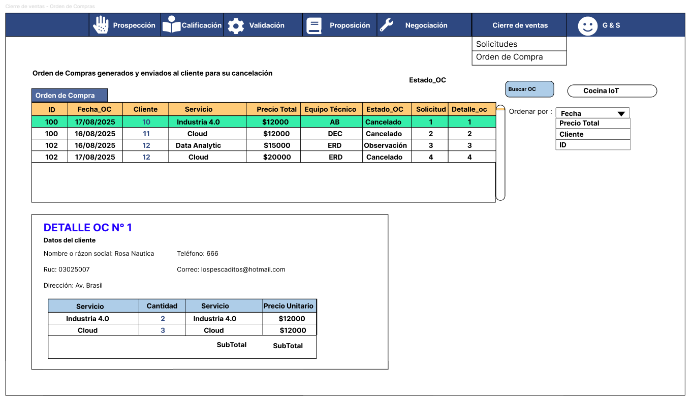
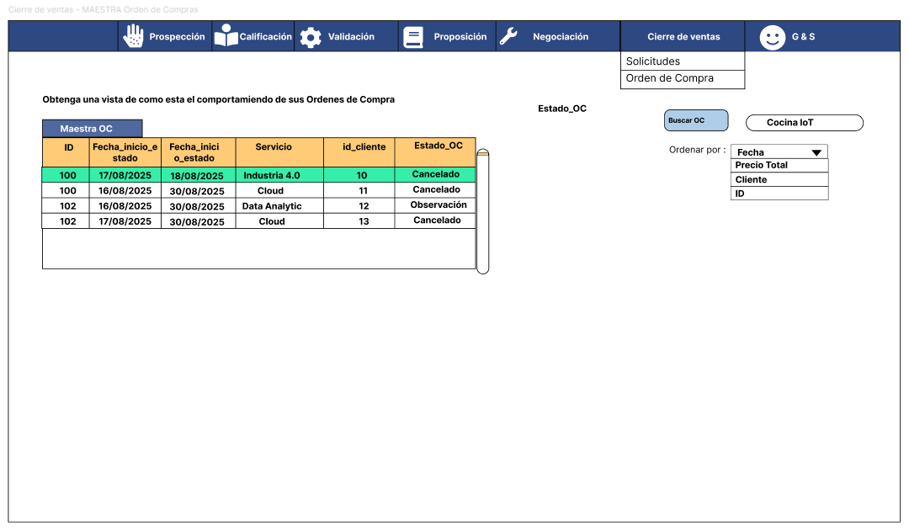
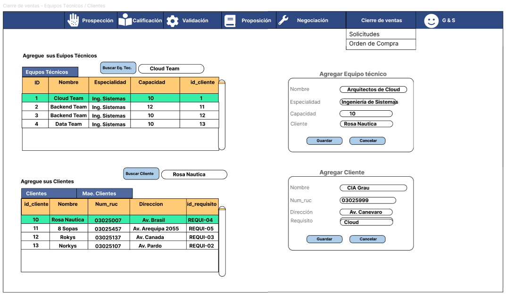
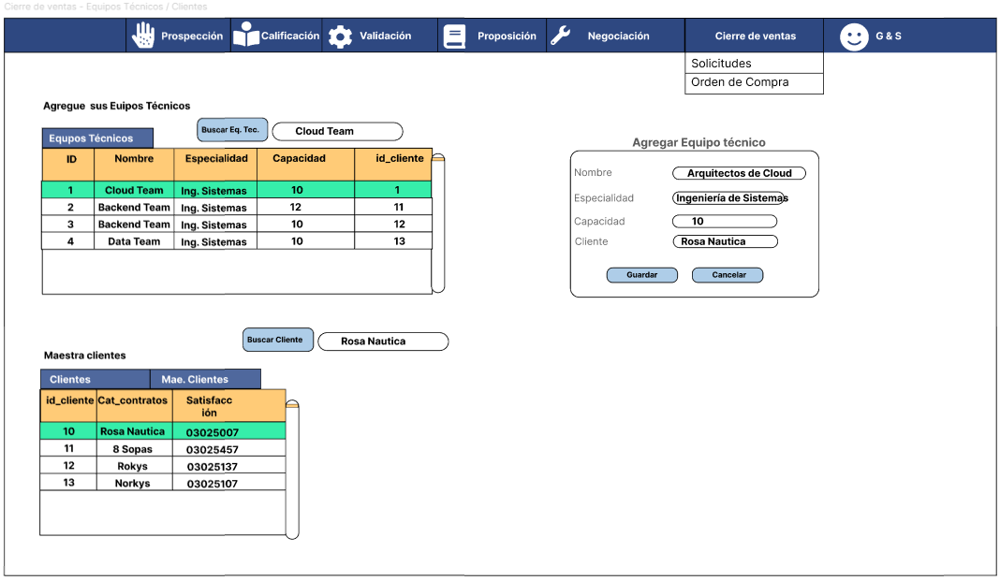
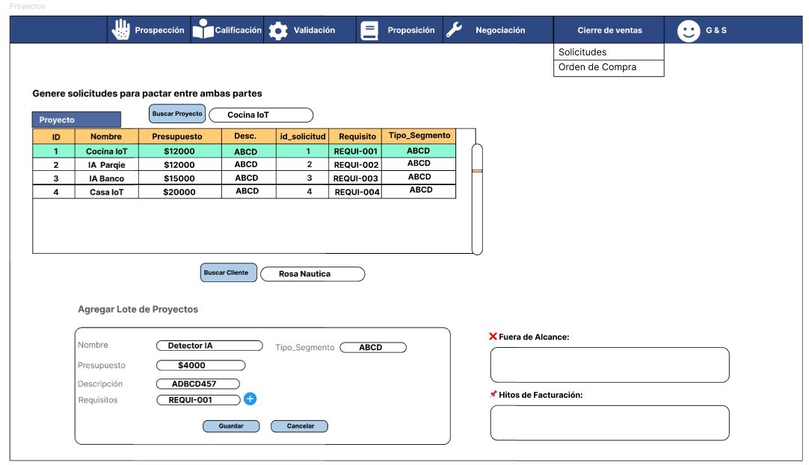

# 3.6. Módulo 6

## Casos de uso:

## 1. Registro de solicitud de cierre comercial

| **Realised User Task**           | **Registro de solicitud de cierre comercial – Requerimiento: CIE-001**                                                  |
|----------------------------------|-----------------------------------------------------------------------------------------|
| **Initiating Actors**            | Ejecutivo Comercial: Responsable de registrar el cierre tras la firma de contrato.     |
| **Participating Actors**         | - Ejecutivo Comercial   - Sistema de Gestión Comercial                              |
| **Flow of Events**               | 1. El contrato es firmado por ambas partes. 2. El ejecutivo comercial registra la solicitud en el sistema. 3. Se adjunta el archivo PDF del contrato. 4. El sistema valida la firma. 5. Se genera la solicitud con estado “Firmado”. |
| **Exceptions**                   | - El contrato no está firmado por ambas partes.  - Falla al cargar el archivo PDF.  |
| **Preconditions**                | Debe existir un contrato firmado válido.                                               |
| **Postcondition**                | La solicitud queda registrada y lista para generar la OC.                              |
| **Includes Use Case**            | Firma de contrato                                                                      |
| **Used Services**                | Servicio de gestión de solicitudes de cierre                                           |
| **Non-functional requirements**  | Validación automática de documentos firmados. Tiempo de carga de menos de 3 segundos. |

### 2. Generación y validación de Orden de Compra (OC)

| **Realised User Task**           | **Gestión de Orden de Compra – Requerimiento: CIE-002**                                 |
|----------------------------------|------------------------------------------------------------------------------------------|
| **Initiating Actors**            | Cliente: Responsable de emitir y cargar la OC. Ejecutivo Comercial: Realiza el seguimiento. |
| **Participating Actors**         | - Cliente  - Ejecutivo Comercial  - Sistema de Gestión de Ventas                   |
| **Flow of Events**               | 1. El sistema genera la solicitud de OC automática tras validarse la firma del contrato. 2. El cliente recibe aviso y sube la OC firmada. 3. El sistema valida los datos de la OC. 4. Si coinciden con el contrato, se marca como “Validada”. 5. Si no coinciden, se registra una observación. |
| **Exceptions**                   | - La OC no es cargada dentro del plazo.  - La OC contiene errores de servicio o montos. |
| **Preconditions**                | La solicitud debe estar en estado “Firmado”.                                            |
| **Postcondition**                | La OC queda validada o en estado “Observada”.                                           |
| **Includes Use Case**            | Validación de contrato                                                                  |
| **Used Services**                | Servicio de carga y validación de OC                                                    |
| **Non-functional requirements**  | Alertas automáticas por vencimiento. Validación de campos críticos (monto, fechas).  |

### 3. Activación de proyecto y equipo técnico

| **Realised User Task**           | **Activación de proyecto y equipo – Requerimiento: CIE-003**                            |
|----------------------------------|------------------------------------------------------------------------------------------|
| **Initiating Actors**            | Coordinador Técnico: Responsable de asignar equipo tras la validación de OC.            |
| **Participating Actors**         | - Coordinador Técnico  - Sistema  - Equipo Técnico                                 |
| **Flow of Events**               | 1. Al validarse la OC, el sistema crea el proyecto. 2. El coordinador asigna el equipo técnico. 3. Se genera el acta de inicio. 4. Se registra un `Ticket_Proyecto` con fechas comprometidas. |
| **Exceptions**                   | - No hay equipo técnico disponible.  - Cliente solicita modificación del alcance.     |
| **Preconditions**                | La OC debe haber sido validada correctamente.                                           |
| **Postcondition**                | El proyecto queda activado con equipo asignado y trazabilidad completa.                 |
| **Includes Use Case**            | Validación de OC                                                                         |
| **Used Services**                | Servicio de activación de proyectos Servicio de generación de acta de inicio          |
| **Non-functional requirements**  | Generación automática de ticket y acta. Trazabilidad completa del responsable y fechas clave. |

### 4. Observación de inconsistencias en Orden de Compra

| **Realised User Task**           | **Observación de inconsistencias en Orden de Compra – Requerimiento: CIE-004**                              |
|----------------------------------|-------------------------------------------------------------------------------------------------------------|
| **Initiating Actors**            | Ejecutivo Comercial                                                                                         |
| **Participating Actors**         | - Ejecutivo Comercial  - Sistema de Gestión de Ventas                                                    |
| **Flow of Events**               | 1. El sistema detecta diferencias entre la OC cargada y el contrato. 2. Se genera una observación automática. 3. El ejecutivo revisa y aprueba o rechaza la OC según el caso. 4. Se notifica al cliente para corregir si es necesario. |
| **Exceptions**                   | - La OC nunca es corregida.  - No hay respuesta del cliente.                                             |
| **Preconditions**                | La OC debe haber sido cargada por el cliente.                                                              |
| **Postcondition**                | La OC se marca como “Observada” o “Validada con observación”.                                              |
| **Includes Use Case**            | Generación y validación de OC                                                                               |
| **Used Services**                | Servicio de validación y observación de documentos                                                         |
| **Non-functional requirements**  | Alertas en tiempo real al detectar diferencia. Historial de observaciones accesible por responsables.    |

### 5. Generación de acta de inicio del proyecto

| **Realised User Task**           | **Generación de acta de inicio del proyecto – Requerimiento: CIE-005**                                     |
|----------------------------------|-------------------------------------------------------------------------------------------------------------|
| **Initiating Actors**            | Coordinador Técnico                                                                                        |
| **Participating Actors**         | - Coordinador Técnico  - Sistema  - Ejecutivo Comercial                                               |
| **Flow of Events**               | 1. Una vez validada la OC, se crea el acta de inicio. 2. El sistema genera el documento con los datos del proyecto. 3. Se firma digitalmente si aplica. 4. Se adjunta al registro del proyecto. |
| **Exceptions**                   | - Error al generar el documento.  - Firma digital no completada.                                        |
| **Preconditions**                | El proyecto debe estar activado tras validación de OC.                                                     |
| **Postcondition**                | Acta de inicio generada y almacenada para trazabilidad.                                                    |
| **Includes Use Case**            | Activación de proyecto y equipo técnico                                                                    |
| **Used Services**                | Servicio de generación de documentos de proyecto                                                           |
| **Non-functional requirements**  | Generación automática en menos de 5 segundos. Formato estándar y compatible con PDF.                    |

### 6. Registro de comentarios de seguimiento

| **Realised User Task**           | **Registro de comentarios de seguimiento – Requerimiento: CIE-006**                                        |
|----------------------------------|-------------------------------------------------------------------------------------------------------------|
| **Initiating Actors**            | Ejecutivo Comercial / Coordinador Técnico                                                                   |
| **Participating Actors**         | - Usuario del sistema  - Sistema de Gestión Comercial                                                     |
| **Flow of Events**               | 1. Un usuario accede a una solicitud o proyecto. 2. Redacta un comentario o seguimiento relevante. 3. El sistema guarda la entrada junto con fecha, autor y vínculo. |
| **Exceptions**                   | - Comentario vacío o malformado.  - Error al guardar.                                                    |
| **Preconditions**                | Debe existir una solicitud activa o un proyecto en curso.                                                   |
| **Postcondition**                | El comentario queda almacenado como parte del historial de seguimiento.                                     |
| **Includes Use Case**            | Registro de solicitud de cierre / Activación de proyecto                                                    |
| **Used Services**                | Servicio de gestión de comentarios y seguimiento                                                            |
| **Non-functional requirements**  | Comentarios accesibles por todos los usuarios asignados. Registros auditables y exportables.            |

## Prototipo

